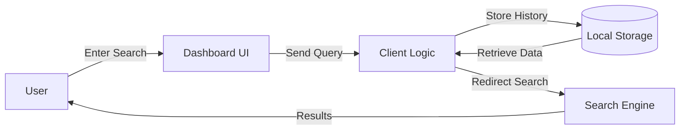

# 🌌 Nebula Dashboard

[](https://github.com/8ernity/NebulaDashboard)
[](LICENSE)
[](https://reactjs.org/)
[](https://threejs.org/)

**Nebula Dashboard** is a cinematic, high-fidelity 3D galaxy visualization designed as a Chrome Extension replacement for your "New Tab" page. It transforms your boring browser history into a vibrant, interactive universe where every website you visit becomes a glowing star.

---

## ✨ Key Features

### 🔭 3D Galaxy Visualization
- **Stars as History**: Your most visited sites are rendered as unique stars within a procedural galaxy.
- **Dynamic Categorization**: URLs are automatically categorized into **Coding**, **Social**, **Video**, and **Other**, each represented by distinct, vibrant color palettes.
- **Cinematic Post-Processing**: High-performance Bloom, Vignette, and Noise effects create a "AAA game" aesthetic.

### 📸 Smart Camera System
- **Auto-Focus**: Clicking a star smoothly glides the camera into a cinematic close-up.
- **Manual Override**: The camera system is "user-aware"—it instantly yields control to you the moment you use your mouse or scroll wheel.
- **Empty Space Deselection**: Click anywhere in the void to reset your view and see the full galaxy.

### 🧊 Glassmorphic Widgets
- **Draggable & Resizable**: Fully interactive widgets for Weather, Time, Calendar, and Search.
- **Boundary Constraints**: An invisible "Safe Zone" prevents widgets from ever being dragged or resized off-screen.
- **Persistent Layout**: Widget positions and sizes are automatically saved to `localStorage`.

### 🔍 Neural Search
- **Visual Feedback**: Searching triggers "Ping" animations on matching stars while dimming irrelevant nodes.
- **Seamless Integration**: Fast, responsive search bar with glassmorphic styling.

---

## 🛠 Technology Stack

- **Frontend**: [React](https://reactjs.org/) with [Vite](https://vitejs.dev/)
- **3D Engine**: [Three.js](https://threejs.org/) via [@react-three/fiber](https://github.com/pmndrs/react-three-fiber)
- **3D Utilities**: [@react-three/drei](https://github.com/pmndrs/drei)
- **Post-Processing**: [@react-three/postprocessing](https://github.com/pmndrs/postprocessing)
- **State Management**: React Hooks (useState, useEffect, useMemo)
- **Styling**: Vanilla CSS with modern Glassmorphism techniques
- **Extension API**: Chrome History & Tabs API

---

## 🚀 Installation & Setup

### Local Development
1. Clone the repository:
   ```bash
   git clone https://github.com/8ernity/NebulaDashboard.git
   cd NebulaDashboard
   ```
2. Install dependencies:
   ```bash
   npm install
   ```
3. Run the development server:
   ```bash
   npm run dev
   ```

### Loading as a Chrome Extension
1. Build the project:
   ```bash
   npm run build
   ```
2. Open Chrome and navigate to `chrome://extensions/`.
3. Enable **Developer mode** (top right toggle).
4. Click **Load unpacked** and select the `dist` folder from this project directory.
5. Open a new tab to see your Galaxy!

---

## 🔄 Data Flow Diagram



## 📂 Project Structure

```text
nebula-map/
├── public/                # Static assets (Manifest, Icons)
├── src/
│   ├── components/        # React Components
│   │   ├── Universe.jsx   # 3D Scene & Camera Management
│   │   ├── Stars.jsx      # Individual Node Logic & Materials
│   │   ├── WidgetWrapper.jsx # Draggable Container Logic
│   │   └── ...            # UI Widgets (Clock, Weather, etc.)
│   ├── App.jsx            # Main Application Logic & Data Fetching
│   ├── main.jsx           # React Entry Point
│   └── index.css          # Global Styles & Glassmorphism
├── index.html             # HTML Entry Point
├── package.json           # Dependencies & Scripts
└── vite.config.js         # Build Configuration
```

---

## 🎨 Customization

### Colors & Categories
You can modify the galaxy colors in `src/components/Stars.jsx`:
```javascript
const CATEGORIES = [
  { name: 'Coding', color: '#4499ff', emissive: '#4499ff' }, 
  { name: 'Social', color: '#ff3333', emissive: '#ff3333' },
  // ...
];
```

### Safe Zone Margins
Adjust the widget boundaries in `src/components/WidgetWrapper.jsx`:
```javascript
const SAFE_MARGIN = 24; // Change this value to adjust the invisible border
```

---

## 📄 License

This project is licensed under the MIT License - see the [LICENSE](LICENSE) file for details.

